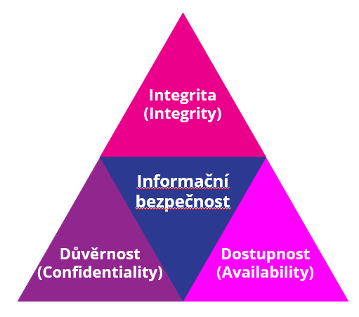

# CIA Triáda

## Důvěrnost (Confidentiality)

>[!TIP]
> Data jsou přístupná pouze tomu, kdo k nim má oprávnění přistupovat.”

- Když se přihlašuješ do internetového bankovnictví, zadáváš heslo nebo používáš mobilní aplikaci pro ověření.
- Banka šifruje přenos dat, aby se nikdo nemohl „napíchnout“ a číst tvoje údaje.
- Příklad porušení: Hacker získá tvoje přihlašovací údaje a uvidí zůstatek i transakce.

## Integrita (Integrity)

>[!TIP]
> Data může měnit pouze ten, kdo k tomu má oprávnění.”

- Když zadáš převod 1000 Kč, banka musí zajistit, že částka a číslo účtu se cestou nezmění.
- Používají se digitální podpisy a kontrolní mechanismy.
- Příklad porušení: Hacker zachytí požadavek a změní částku na 10 000 Kč.

## Dostupnost (Availability)

>[!TIP]
> Data / systémy jsou dostupné právě tehdy, když je legitimní uživatel chce použít.

- Služba je online 24/7 a má zálohy pro případ výpadku.
- Používají se firewally a ochrany proti DDoS útokům.
- Příklad porušení: Banka má výpadek a nemůžeš poslat peníze včas.
